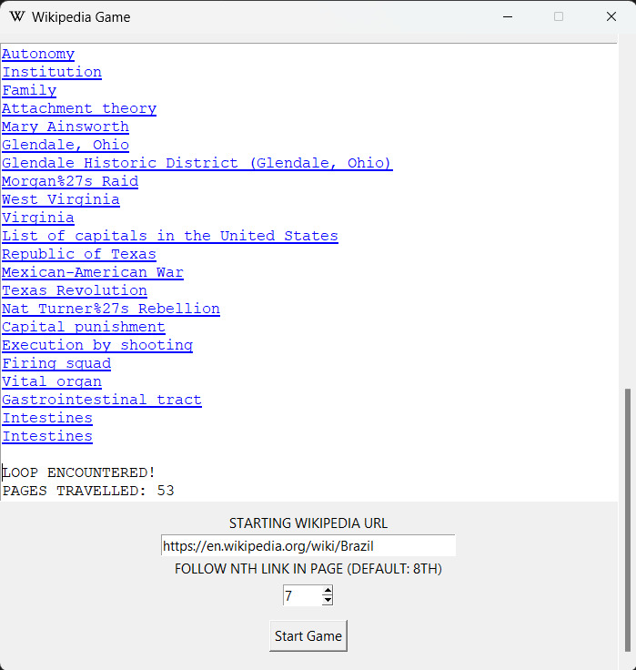

# Wikipedia Game

A simple, fun game that explores Wikipedia by following links in the article's body. Try to get the longest link chain without running into a loop or a page with too few links!

<div align="center">

</div>

## How it works

Insert your starting Wikipedia link in the labeled input field and specify which link to follow in each article. By default, the program will follow the 8th link.

Once you click "Start game", the program will fetch the HTML content of the given Wikipedia page and scrape it for links within the article's body of text. Links within infoboxes, sidebars or external links will not be considered.

If there is an nth link, it will fetch the link's HTML and repeat the scraping process on it. The program will go on until it comes across a url it has already found before or finds an article with less than n links, at which point the game will end.

## Getting started

#### Requirements:
- The most recent Python version

#### Clone the repository and access its directory through the terminal
```sh
git clone https://github.com/AndreCruz2005/WikipediaGame.git
cd WikipediaGame
```

#### Set up a Python virtual environment
```sh
python -m venv venv
# Activate the venv with:
venv\Scripts\activate # Windows
# or:
source venv/bin/activate # macOS/Linux
```

#### Install the project's dependencies
```
pip install -r requirements.txt
```

#### Run the scraper.py file with python to play the game
```
python scraper.py
```


